### Instructions
**Prerequisites** 
Ensure you have: 
- Access to the **AQ Warnings** Teams channel 
- Login credentials for [shinyapps.io](https://login.shinyapps.io/login?redirect=%2Foauth%2Fauthorize%3Fclient_id%3Drstudio-shinyapps%26redirect_uri%3Dhttps%253A%252F%252Fwww.shinyapps.io%252Fauth%252Foauth%252Ftoken%26response_type%3Dcode%26scopes%3D%252A%26show_auth%3D0) 
- Access to the **bcgov GitHub** organization 

For help, contact Gail Roth, Sakshi Jain, or Donna Haga.
There are also how-to videos on the **AQ Warnings** Teams channel.

**1. Generate the warning (Shiny App)**

▶ Steps

- Log in: [shinyapps.io](https://login.shinyapps.io/login?redirect=%2Foauth%2Fauthorize%3Fclient_id%3Drstudio-shinyapps%26redirect_uri%3Dhttps%253A%252F%252Fwww.shinyapps.io%252Fauth%252Foauth%252Ftoken%26response_type%3Dcode%26scopes%3D%252A%26show_auth%3D0)  
- Launch the **aqwarnings_shiny** app
- Select warning type in the sidebar on the left  
- Enter warning details  
- Generate the warning: Click **Go!** button  

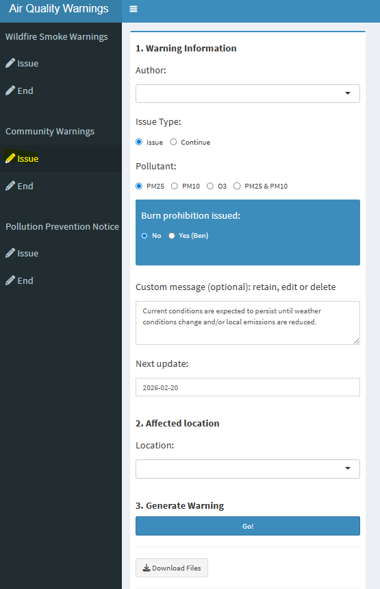  

- Wait for the notification box in the bottom right: Processing complete. Files are ready for downloading.  

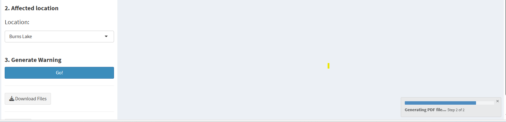  

- Download the ZIP archive and save to your Downloads folder  
- Review the PDF to ensure all details are correct  

  

**2. Publish the warning on GitHub Pages**  
Two options are described here: GitHub.com (recommended) or GitHub Desktop.

<strong>▶ GitHub.com (recommended)</strong>

1. Open the repository: [https://github.com/bcgov/aqwarnings](https://github.com/bcgov/aqwarnings)

2. Navigate to the [frontend/warnings](https://github.com/bcgov/aqwarnings/tree/main/frontend/warnings) subdirectory in the `main` branch

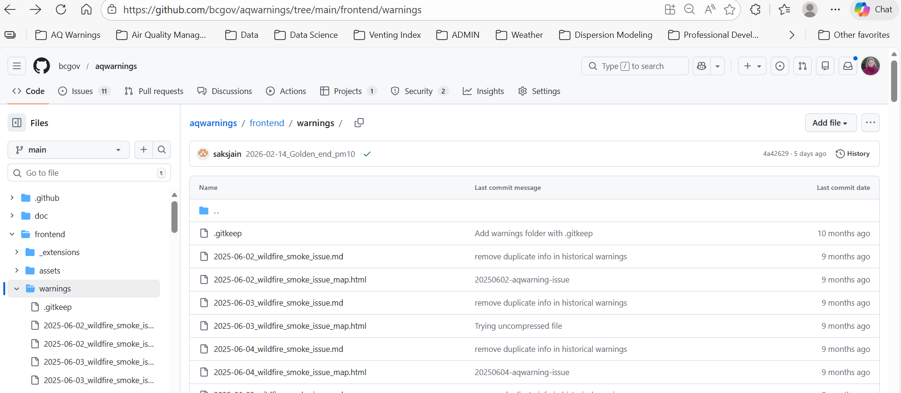 

3. Upload file(s)
- Select **Add file → Upload files**  
- For local-emission warnings or pollution prevention notices, drag the `.md` file(s) from the ZIP archive.  
- For wildfire smoke warnings, drag the `.md` file and the `.html` file from the ZIP archive.  

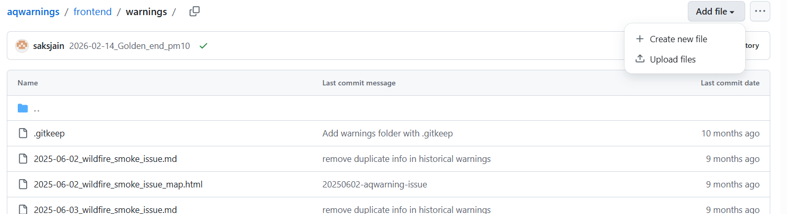  
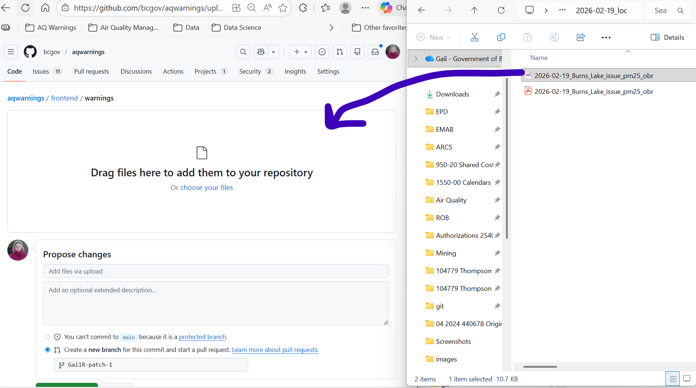  

4. Propose changes
- Use this naming convention for the commit message and branch name: `YYYYMMDD-aqwarning-issue`
- Click **Propose changes**. 
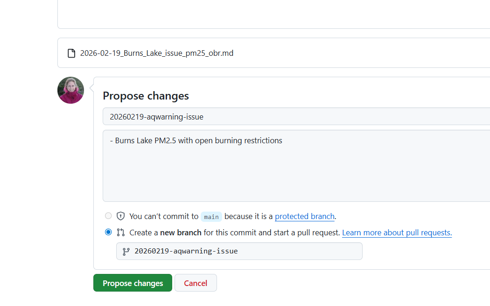  

5. Create Pull Request
- Confirm the Pull Request will merge into the **main** branch
- Click **Create pull request**.  

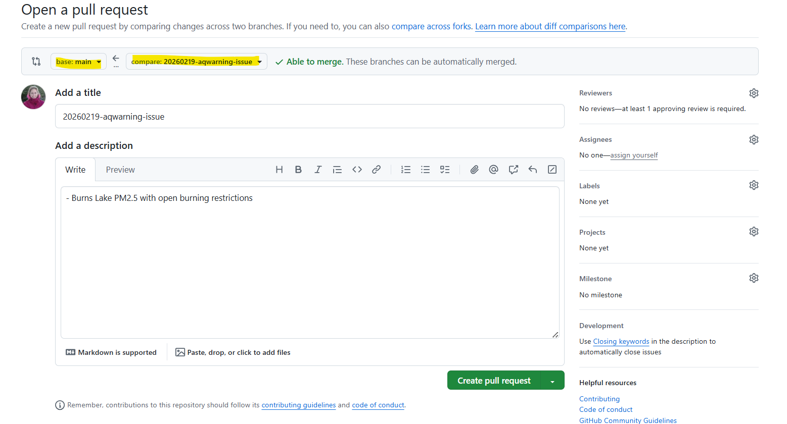  

6. Review Automated Checks
- Wait for the **PR Preview Action** comment
- Open the preview
- Verify the warning appears correctly
- Use back button to return to the Pull Request page  

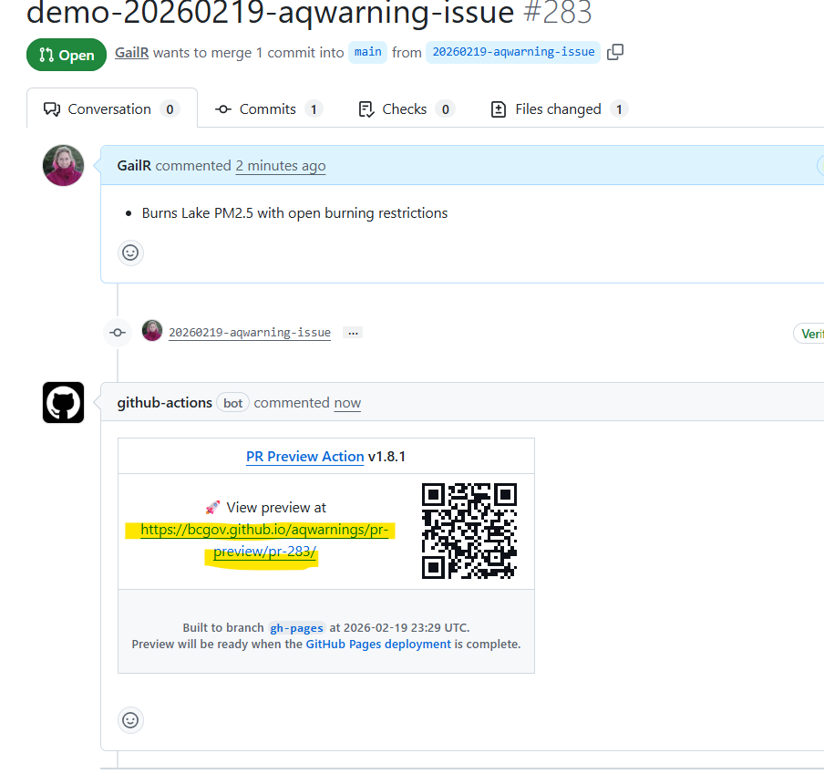 

7. (Optional) Request Review  
To bypass a review:
- Select: Merge without waiting for requirements
- Click **Bypass rules and merge**  

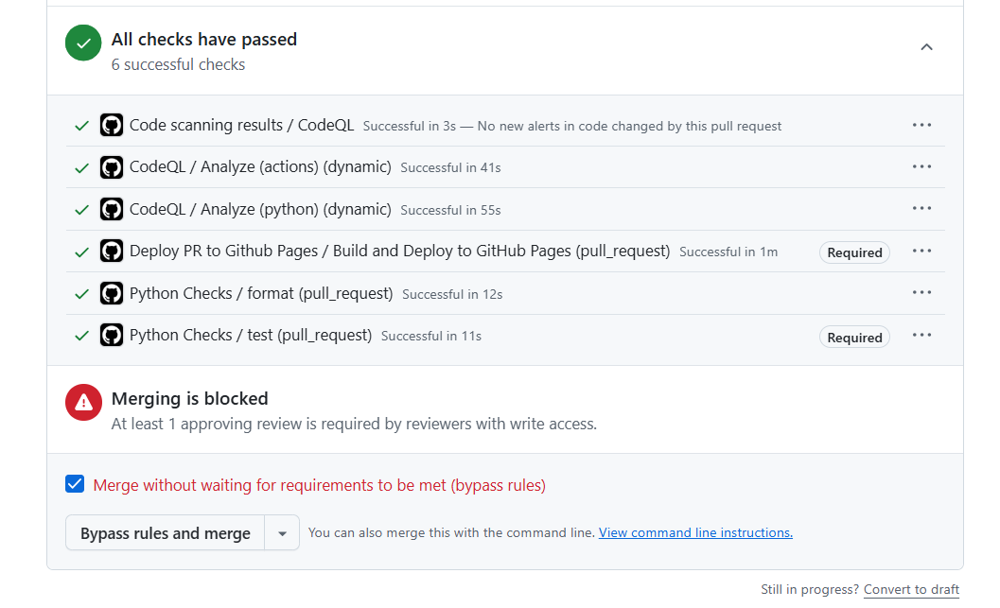

8. Publish
- Merge the Pull Request and wait a few minutes. 
- Confirm the warning appears at [https://aqwarnings.gov.bc.ca](https://aqwarnings.gov.bc.ca)

<strong>▶ GitHub Desktop</strong>

1. Open the aqwarnings Repository
- Open **GitHub Desktop**  
- Select or clone `bcgov/aqwarnings`    
- Ensure branch = **main**  
- Click **Fetch origin**  

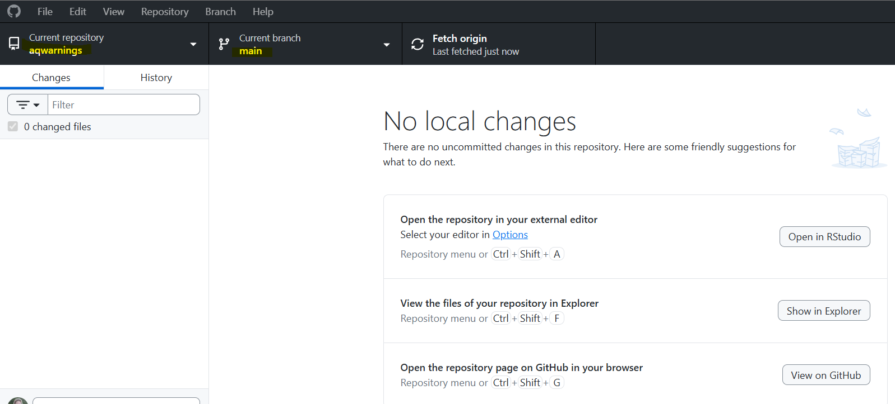  

2. Create a new branch
- Click **Current branch (main)**  
- Under branches select **New branch**.   
- Branch naming format: `YYYYMMDD-aqwarning-issue`  

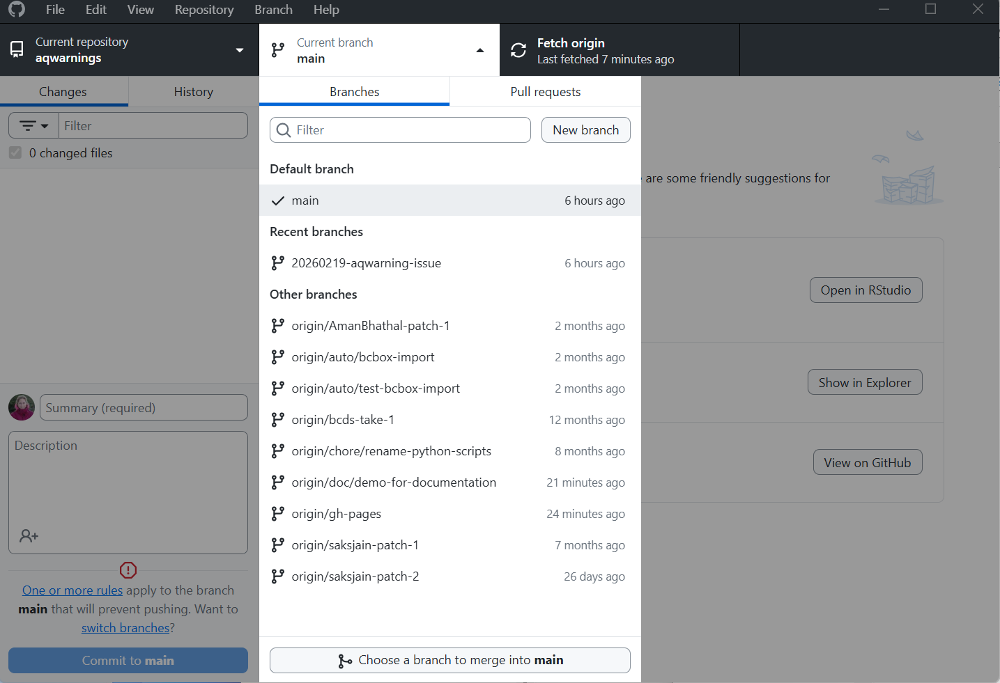  

3. Navigate to the warnings folder
- Select **Show in Explorer**  
- In Windows Explorer, navigate to the `\frontend\warnings` subfolder.  

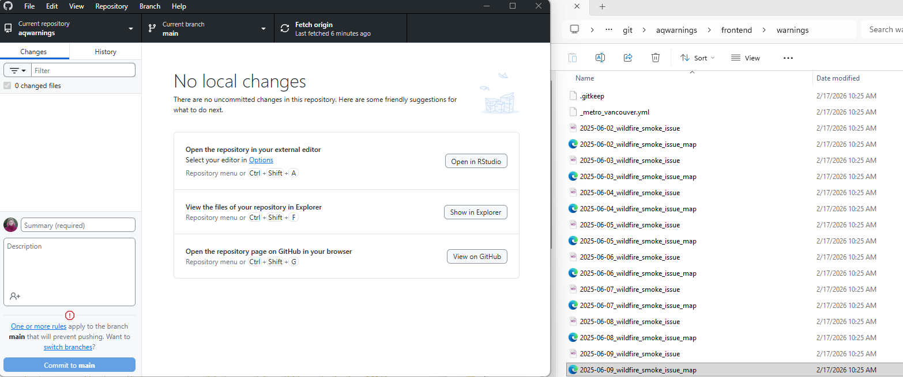  

4. Move files to GitHub repository
- For local-emission warnings or pollution prevention notices, drag the `.md` file(s) from the ZIP archive to the `\frontend\warnings` subdirectory  
- For wildfire smoke warnings, drag the `.md` file and `.html` file from the ZIP archive to the `\frontend\warnings` subdirectory  

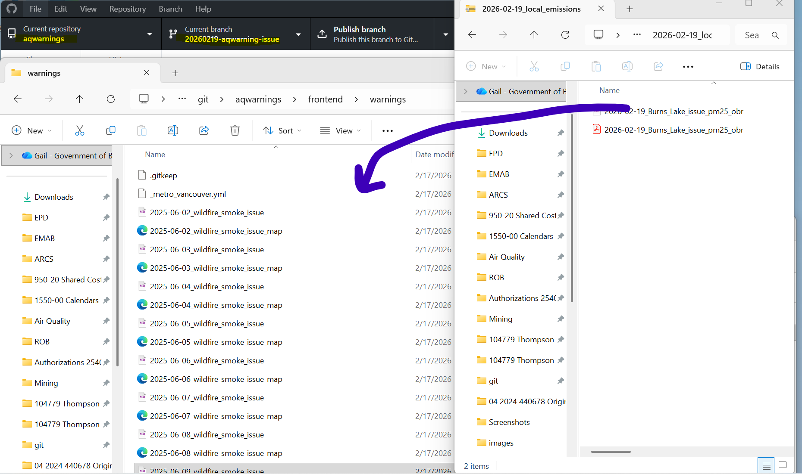  

5. Commit changes
- In GitHub Desktop view changes in left sidebar.  
- Ensure check-box beside each file is selected.   
- Add a title to the summary box (bottom of the left side bar) with the following format:`YYYYMMDD-aqwarning-issue`  
- (Optional) add a description  
- Click **Commit** button  

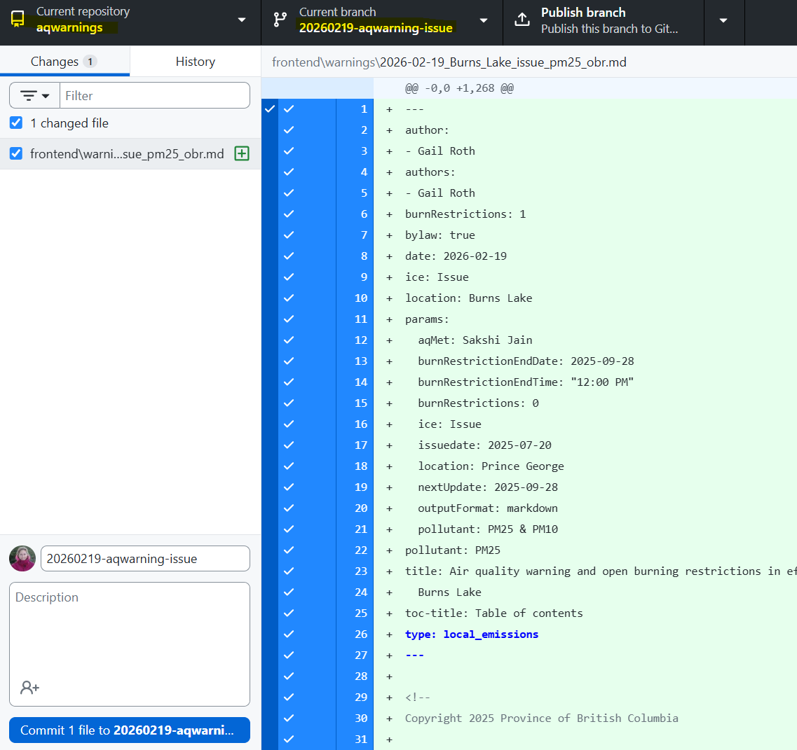  

6. Publish branch

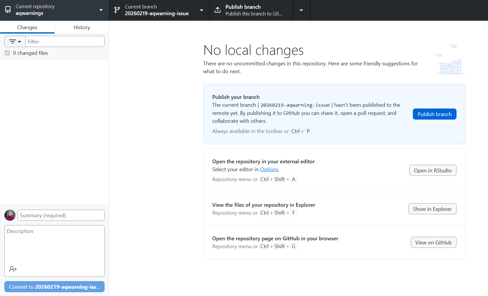  

7. Preview pull request
- Click **Preview Pull Request**  
- A window will pop up showing files to be committed  
- Verify all intended files are included, then click **Create Pull Request**.  

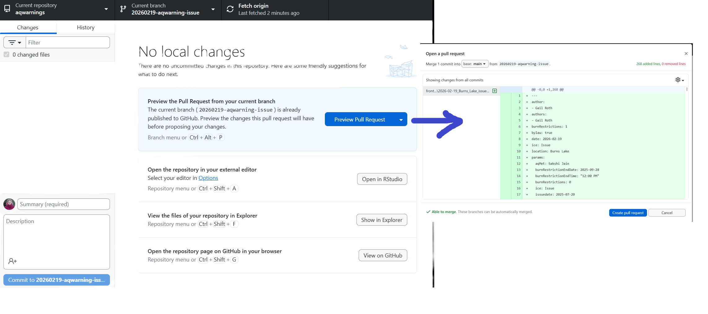  

8. Open Pull Request
- You will be redirected to the Pull Request in the [aqwarnings GitHub repository](https://github.com/bcgov/aqwarnings) on Github.com  
- Confirm that the Pull Request target is the `main` branch (see highlighted text in screenshot)  
- Click **Create pull request**.  

  

9. Review automated checks
- Wait for the Pull Request Preview Action comment  
- Open the preview link  
- Navigate through the preview site to verify the warning appears correctly  

  

10. (Optional) Request a review
- To bypass a review  
    - check "Merge without waiting for requirements to be met (bypass rules)"  
    - click on **Bypass rules and merge button** 
    
  

11. Publish
- Click **Confirm Merge pull request**  
- Wait a few minutes  
- Confirm the the warning appears on [https://aqwarnings.gov.bc.ca](https://aqwarnings.gov.bc.ca)

  

**3. Notify Subscribers**  
Once the warning is live, send Air Quality Subscription (AQSS) notifications using the standard process (see AQ Warnings Teams channel for instructions).

**4. File the PDF in ORCS and update summary stats**  
In the ORCS directory **26600-04 Reporting - Air Quality Warnings**:  
- Save PDF(s) from the ZIP archive  
- Update summary file: **summary_warnings_local_emissions.xlsx**  

