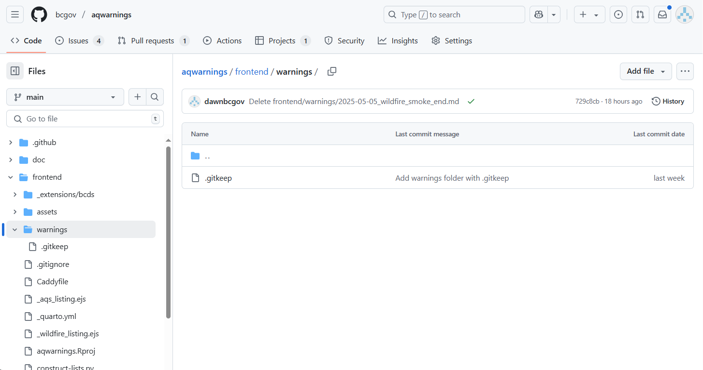

# Issue an Air Quality Warning - Wildfire smoke

Before you begin, you should have access to: 
- the [Wildfire channel](https://teams.microsoft.com/l/channel/19%3Adbcd68403ff248a5b85d86b3c0f2edfb%40thread.tacv2/Wildfire?groupId=08b39b07-19dc-4340-9e31-ecea7c416570&tenantId=6fdb5200-3d0d-4a8a-b036-d3685e359adc) in Microsoft Teams, 
- username and password for [ShinyApps.io](login.shinyapps.io), and 
- be added to the [GitHub](github.com) `bcgov` organization. 

Speak to Gail Roth, Sakshi Jain, or Donna Haga for any access and onboarding questions.

## Issue warnings using ShinyApps.io

Here are the steps to **issue** an air quality warning: 

1. Login to the AQ Warnings ShinyApp: https://bcgov-env.shinyapps.io/aqwarnings_shiny/ 
    - You will see a message "Authorization Required. Access to this content is restricted."
    - Select “Login”, enter the username and password you have been provided

2. Complete the fields, following the prompts in the application:
    - Select your name from the author drop-down
    - Confirm or edit the length of time wildfire smoke expected to last
    - Confirm or select the date for next update
    - Add a custom smoke outlook message (optional)

3. Select the impacted regions on the map:
    - Hover over regions with your cursor to see their names
    - Click to select/de-select a region, once selected the region will be highlighted yellow. If needed, you can de-select all the regions on the map using the "Reset Map" button above the map.
    - Several layers can be overlaid on the map using the check-boxes in the legend in the upper right corner of the map window. These layers can be useful when informing your decision (for example, to see extent of smoke impact) 

4. Select or create a description summarizing what areas of the province will be included in the Warning. Under "Describe regions affected", you can either:
    - select from pre-packaged descriptions using the drop down menu, or
    - type in a custom description in the field.

5. Select "Go!" to generate the Air Quality Warning:
    - It may take some time to generate, you will see pop-up toasts in the lower right sidebar once it has finished. You are looking for these messages: "PDF generation complete!" and "Markdown generation complete!".

6. Select "Download Files":
    - A system dialog box may open to ask where you want to save a compressed ZIP archive->Select the location and press "Save".
    - In Chrome, the ZIP archive will automatically get saved to your "Downloads" folder. 
    - At this stage you may want to open the archive and review the Air Quality Warning PDF to ensure the meteorologist, region, and smoke outlook message are correct

## Publish warnings via GitHub Pages

Once you have the archive saved you are ready to publish it to the [AQ Warnings](https://aqwarnings.gov.bc.ca/) web site.

[AQ Warnings](https://aqwarnings.gov.bc.ca/) is hosted on GitHub pages. To add warnings you make a Pull Request (PR) on that site, which you can initiate from either:
- In the browser at https://github.com
- GitHub Desktop 
- RStudio
- the git command line interface

We will only cover using GitHub.com below and encourage everyone to follow this process.

### Using Github.com in the browser

1. Open the website repository at Github.com [https://github.com/bcgov/aqwarnings](https://github.com/bcgov/aqwarnings) and make sure you are logged in.

2. Go to the folder `frontend/warnings/` you will add all warnings to: [https://github.com/bcgov/aqwarnings/tree/main/frontend/warnings](https://github.com/bcgov/aqwarnings/tree/main/frontend/warnings)

   

3. Click "Add file", in the drop down select "Upload files".

4. Select and move the Markdown (.md) and map (.html) files from the zip archive you downloaded to this page by dragging and dropping or clicking "choose your files" and selecting them in the system dialog box.

5. Under the header "Propose changes" 
    - Add a commit message and change the branch name from the default "<username>-patch-N", for both we use the following naming convention:
      `YYYYMMDD-aqwarning-<status>`, for example: `20250502-aqwarning-issue`
    - You don't need to enter anything into the bigger box (with the placeholder text "Add an optional extended description...")
    - Select "Propose changes"

6. You will go to a page to open a pull request, review the contents 
  - The commit message you entered in GitHub desktop above will be the PR message under "Add a title"
  - There will not be anything under "Add a description" and you do not have to add anything at this stage.
  - Select “Create pull request”.
  
10. Wait for automated checks to run on the PR and review your changes.
  - You will be redirected to a new page for the PR you just created, the title will be the commit message (eg. "20250502 aq warning issue #46")
  - You may see a message under your comment in the PR saying “Some checks haven’t completed yet”. When the checks have completed, a new comment will show up “PR Preview Action”. Click to open the link below this to preview the page and Air Quality Warning (e.g. https://bcgov.github.io/aqwarnings/pr-preview/pr-XX/).
  - Review the content at that link, what you are seeing is a complete new copy of the web site with the new warning included. You will have to view the actual warning to make sure the warning message and appearance are what you expected.

11. (Optional) Have another member of your team review and approve changes.
  - A number of Meteorologists will be automatically be assigned to review the issue.
  - If you need to assign another reviewer, from the PR page:
    - Select the gear in the right sidebar, beside "Reviewers"
    - Type the github username of anyone you want to add, when you click out of that menu, you will see their name under reviewers, they will recieve an email.

11. Publish your changes by merging the pull request.
  - Once your change have been reviewed, you are ready to publish your changes.
  - From the PR page. Scroll down below your comment and select "Merge pull request". 
  - The website will automatically be rebuilt with the new warning showing! Give it a few minutes and visit the site: https://aqwarnings.gov.bc.ca to confirm it is live before publishing.
  

## Step 2: Air Quality Subscription Service and on Social Media

Once the changes are on [AQ Warnings](https://aqwarnings.gov.bc.ca/), you can notify AQSS subscribers and publish to social media. This process has not changed from last year.
